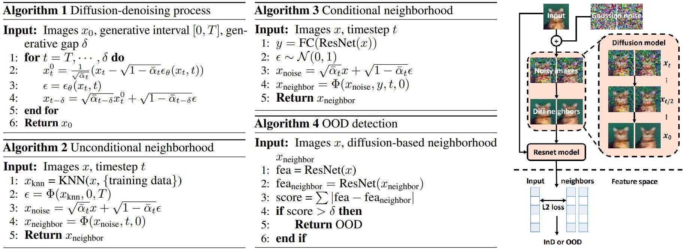

# Diffusion Denoising Process for Perceptron Bias in Out-of-distribution Detection

This repo is the official PyTorch implementation for the paper [Diffusion Denoising Process for Perceptron Bias in Out-of-distribution Detection](https://arxiv.org/abs/2211.11255)

by Luping Liu, Yi Ren, Xize Cheng, Zhou Zhao (Zhejiang University).

## What does this work do?

In this work, we provide a new perceptron bias assumption that the discriminator models are 
more sensitive to some subareas and build OOD detection methods and 
indicator scores based on this assumption. Our detection methods combine the discriminator and 
generation models, which uses a ResNet to extract features and the diffusion denoising process 
of a diffusion model (with classifier-free guidance) to reduce overconfidence areas. Our methods are explainable and have a clear 
motivation, in the meanwhile, they get competitive OOD detection results with SOTA methods.



## Code structure

- **Model**: DDIM
- **Dataset**: Cifar10, Cifar100
- **Runner**:
  - runner: basic training and sampling
  - ood_detection: diffusion-based OOD detection

## How to run the code

### Dependencies
Run the following to install necessary python packages for our code.
```bash
pip install -r requirements.txt
```

### Usage
Train the diffusion models through main.py.
```bash
python main.py --runner base_train --config 32_cifar10_cond.yml --train_path temp/train/base_multi
torchrun --nproc_per_node 2 main.py --runner train --config 32_cifar10_ood_cf.yml --train_path temp/train/base_multi
```
- runner: choose the mode of runner 
- device: choose the device to use
- config: choose the config file
- train_path: choose the path to save training status

Evaluate the diffusion models through main.py.
```bash
python main.py --runner base_fid --method DDIM --sample_speed 50 --device cuda --config 32_cifar10_cond.yml \
  --image_path temp/results --model_path temp/models/ddim/ema_cifar10.ckpt
```
- method: choose the numerical methods
- sample_speed: control the total generation step
- image_path: choose the path to save images
- model_path: choose the path of model

Generate samples for OOD detection through main.py
```bash
python main.py --runner ood_itp --config 32_cifar10_cond.yml --method DDIM --sample_speed 50 \
  --model_path temp/train/ema-140000.ckpt --model_name cifar10 --repeat_size 4
```
- model_name: choose the name for in-distribution datasets
- repeat_size: choose the number of repeat samples

Generate OOD detection results through detect.py
```bash
python detect/ood_detect.py --repeat_size 4 --id_name cifar10
```
- id_name: choose the name for in-distribution datasets

### Checkpoints & statistics

All checkpoints of models and precalculated statistics for FID are provided in this [Onedrive](https://zjueducn-my.sharepoint.com/:f:/g/personal/3170105432_zju_edu_cn/Emku5883xv5AqG6pRUXFM_oBXPSqieX-6rdT81MSsoGeMA).


## References

If you find the code useful for your research, please consider citing:

```bib
@misc{liu2022diffusion,
      title={Diffusion Denoising Process for Perceptron Bias in Out-of-distribution Detection}, 
      author={Luping Liu and Yi Ren and Xize Cheng and Zhou Zhao},
      year={2022},
      eprint={2211.11255},
      archivePrefix={arXiv},
      primaryClass={cs.CV}
}
```

This work is built upon some previous papers which might also interest you:

- Song, Jiaming, Chenlin Meng, and Stefano Ermon. "Denoising Diffusion Implicit Models." International Conference on Learning Representations. 2020.
- Liu, Luping, et al. "Pseudo Numerical Methods for Diffusion Models on Manifolds." International Conference on Learning Representations. 2021.
- Yang, Jingkang, et al. "OpenOOD: Benchmarking Generalized Out-of-Distribution Detection." Thirty-sixth Conference on Neural Information Processing Systems Datasets and Benchmarks Track.
